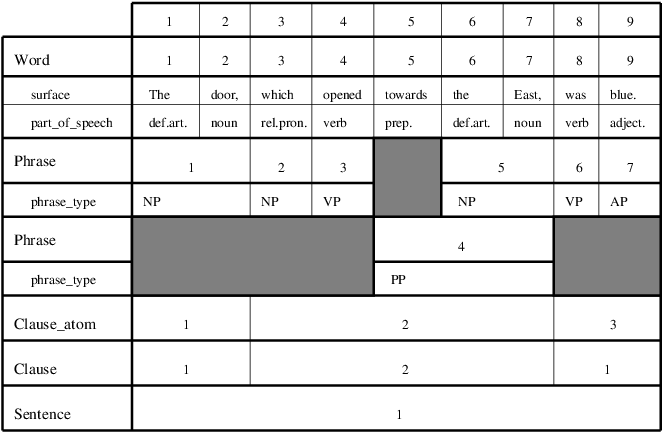

# Example

We have now defined all of the four major concepts in the EMdF model:
monad, object, object type, and feature. It is time to make them more
concrete by giving an example of a very small EMdF database. Look at
the following illustration:

At the top of the figure, you see the sequence of monads, 1 to 9. Just
below this sequence, you see the object type “Word” with its object
ordinals, 1 to 9. In this example, the granularity is “one monad, one
word.” Thus *Word* number 1 corresponds to *monad* number 1, but they
are really separate entities. Word number 1 *consists of* the set of
monads {1}.

This becomes clearer when you notice that Clause number 2 consists of
the set of monads {3,4,5,6,7}. Thus there
is a fundamental distinction between the number of an object (also
called object ordinal), and the set of monads making up that object.

Some of the object types in the figure (Word and Phrase) have a number
of *features*. The object type “Word” has the features “surface” and
“part\_of\_speech”. The “Phrase” object type has only one feature,
namely “phrase\_type”.

Notice that objects can be discontiguous. The Clause object with object
ordinal 1 consists of the monads
{1,2,8,9}. Thus there can be gaps in an
object.

Notice also that an object type need not have features. The object types
Clause\_atom, Clause, and Sentence have no features in the figure.
