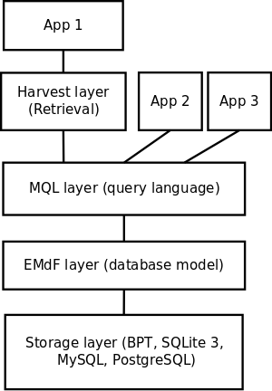

# Emdros' architecture

The following depicts the Emdros architecture:

## Layers

1. At the bottom, we have the **storage layer**.  The user of Emdros
would never interact directly with this storage layer, but only
indirectly, through the MQL or Harvest layer.  The storage layer has 
various backends:

    1. The BPT engine
    2. SQLite 3
    3. MySQL / MariaDB
    4. PostgreSQL

2. The next layer, the EMdF layer, implements Emdros's **database
model**, the EMdF model.  This is the layer that knows about:

    1. object types,
    2. objects, 
    3. features, 
    4. feature types, 
    5. enumerations, 
    6. enumeration constants, 
    7. ... and other data domains of the EMdF model.

3. The next layer, the **MQL language layer**, implements Emdros's **query
language**.  This is a full query language, with Create, Retrieve,
Update, Delete capabilities for all aspects of a database.  It
comprises:

    1. Schema creation, retrieval (introspection), update, deletion
    2. Data creation, retrieval, update, delete

4. The next layer, the **Harvest layer**, implements:

    1. An object rendering engine (**renderobjects**), which is able to
    replay (parts of) an Emdros database as documents (XML, HTML, JSON,
    whatever document format you need).  This is done through a
    declarative language saying what should be done at the start and
    end of a given number of object types, which features should be
    retrieved, what should be emitted to the document, etc.  The
    necessary objects are automatically retrieved, and played back in
    the right order.

    2. An XML processing (**renderxml**) engine which is able to take an
    XML document (such as that output by the renderobjects engine) and
    transform it based on a declarative language similar to the
    language used by the renderobjects engine.

    3. A Full Text Search engine (**harvest_fts**).  This is able to 
    query an Emdros database based on a
    "context" object type, a "token" object type, and various other
    parameters. For example, in a database of plays, one might want to
    search within the segments of text that an actor speaks.  The FTS
    modules also implement retrieval of "snippets" of the text.

## Basic usage patterns

The user would call either:

1. the MQL layer alone, or
2. the Harvest layer alone, or
3. (most likely) some combination of the two.

### Locating and displaying text

For example, in order to locate and display a piece of text, the user might go through the following steps:

1. the MQL query `SELECT ALL OBJECTS` could be used to locate "hits".
2. Then the result of this query could be used to generate a "hits" set of monads, meaning we are interested in the context of the monads in this monad set.
3. Then the `GET OBJECTS HAVING MONADS IN` query could be used with this "hits" set of monads to find the ranges of text to play back.  This could be done based on some object type such as `Sentence` or `Paragraph`.
4. Then the harvest layer could be invoked to play back the given part(s) of the database as XML, JSON, HTML, or whatever is necessary.  
5. Then the results could be displayed to the end user.

### Full Text Search

For example, in order to perform a full text search, display snippets to the end user, and then let the end user choose which snippet to investigate in more detail, the following steps could be used:

1. The Harvest layer would be invoked with the parameters of the query, the token object type, and the snippet context object type.  This would result in a paginated series of hits.
2. The Harvest layer would be invoked to retrieve the snippets of text based on one or more pages from the hits.
3. The snippets would be displayed to the end-user, with links having monad sets embedded enabling the next stage to locate the snippet in question.
4. If the end user activates a given snippet's link, then the monad set associated with that link is handed to the renderobjects engine, in order to retrieve the document part containing the snippet.
5. This document part is displayed to the user.  Alternatively, it is subjected to further processing, such as statistical measurements.

